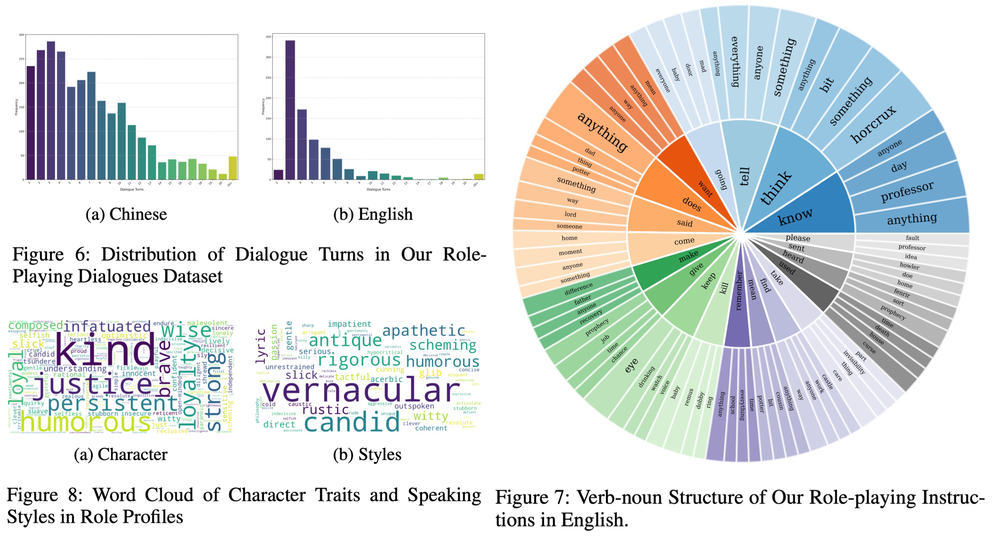
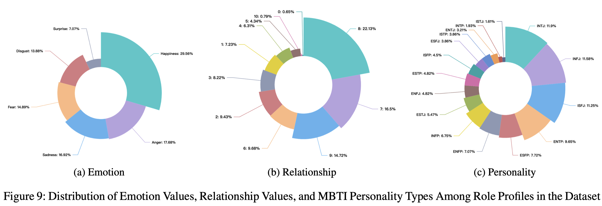

<div align= "center">
    <h1> 🎭 Beyond Dialogue 💭 </h1>
</div>
<p align="center">
<a href="https://github.com/choosewhatulike/character-llm/blob/main/LICENSE">
</a>


</p>

<p align="center">  
<strong> BEYOND DIALOGUE: A Profile-Dialogue Alignment Framework Towards General Role-Playing Language Model </strong>
</p>

<p align="center"> <strong>
📄 <a href="https://web3.arxiv.org/abs/2408.10903">Paper</a> ·
📊 Dataset (upcoming) · 
🤗 Models (upcoming) ·
🏆 Evaluation (upcoming)
</strong>
</p>

We introduce **BEYOND DIALOGUE**, a novel framework designed to revolutionize role-playing model training by addressing key challenges in current approaches. Traditional methods that rely on predefined role profiles, which often lead to **inconsistencies and biases between predefined profiles and scenario dialogues**, **BEYOND DIALOGUE** introduces a unique approach by **aligning dialogues with role profile traits specific to each scenario**. This approach ensures fine-grained profile-dialogue alignment at the sentence level, **fully automated and cost-effective**. Our framework outperforms existing baselines in adhering to various role profile dimensions. For more details, please refer to the [paper](https://web3.arxiv.org/abs/2408.10903).


## What's New

- **[2024/08/22]** Our [paper](https://arxiv.org/abs/2310.00746) is released.

## Why Profile-Dialogue Alignment? 🤔

<p align="center">
  
</p>

-  **Using a predefined role profile to prompt dialogue training for specific scenarios usually leads to inconsistencies and even conflicts between the dialogue and the profile, resulting in training biases.**
- **The model learns to imitate the role based solely on the profile, neglecting profile-dialogue alignment at the sentence level.**

## What's Beyond Dialogue? 🚀


- **We use an innovative prompting mechanism in GPT-4o to generate fine-grained CSERP alignment tasks as "beyond dialogue" training data. This approach ensures detailed alignment between profiles and dialogues, enhancing the model’s reasoning capabilities and adherence to profiles.**
- **Taking inspiration from actors learning to play different roles -- understanding the performance of various role traits in scenarios to enhance their portrayal -- we also employ fine-grained alignment tasks to train the role-playing model.**

## Framework 📚


- The left side shows the training phases, which include **role-playing dialogue, chit-chat, and profile alignment**. The profile alignment results are utilized to adjust each scenario’s dialogue profiles, eliminating training biases. 
- On the right, the **LLM generates random scenarios and roles for multi-turn dialogues with the model**, followed by an evaluation using **objective questions (such as multiple-choice questions, judgmental questions)** to obtain quantitative metrics of the model’s role-playing capabilities.

## Dataset Statistics 📊

| **Dataset**      | **Source**       | **Open-source** | **Multi-lingual** | **Multi-turn** | **# Roles**           | **# Sessions** | **# Turns** | **# Ave Turns** |
|------------------|------------------|-----------------|-------------------|----------------|-----------------------|----------------|-------------|-----------------|
| [HPD](https://github.com/nuochenpku/Harry-Potter-Dialogue-Dataset)          | Novel            | ✔               | ✔                 | ✔              | -                     | 1042           | 14380       | 13.8            |
| [CharacterGLM](https://github.com/thu-coai/CharacterGLM-6B) | Novel & Human & GPT | ✘           | ✘                 | ✔              | 250                   | 1034           | 16316       | 15.78           |
| [RoleLLM](https://github.com/InteractiveNLP-Team/RoleLLM-public)      | GPT              | ✔               | ✔                 | ✘              | Zh: 5, En: 95         | -              | 23463       | -               |
| [CharacterLLM](https://github.com/choosewhatulike/trainable-agents) | GPT              | ✔               | ✘                 | ✔              | 9                     | 1600           | 21120       | 13.2            |
| [PIPPA](https://huggingface.co/datasets/PygmalionAI/PIPPA?not-for-all-audiences=true)        | Human            | ✔               | ✘                 | ✔              | 1254                  | 26000          | 1049015     | 40.34           |
| [ChatHaruhi](https://huggingface.co/datasets/silk-road/ChatHaruhi-54K-Role-Playing-Dialogue)  | Novel & GPT      | ✔               | ✘                 | ✔              | 32                    | 54726          | 67660       | 1.23            |
| [WIKIROLE](https://github.com/OFA-Sys/Ditto)     | GPT              | ✔               | ✔                 | ✔              | Zh: 3184, En: 3902    | 7086           | 36164       | 5.1             |
| **Ours**         | Novel            | ✔               | ✔                 | ✔              | Zh: 280, En: 31       | 3552           | 23247       | 6.54            |

>**Note:** In the HPD dataset, the number of roles is denoted as "-" since it is exclusively centered on Harry Potter, with other characters interacting with him. RoleLLM is single-turn, so # Sessions and # Avg Turns are marked as "-".

- We extracted 280 Chinese roles and 31 English roles from 123 Chinese and English novels or scripts. In total, 3,552 sessions of scenario dialogues were obtained, comprising 23,247 dialogue turns, all drawn from authentic dialogues in novels or scripts.

- From the table, it can be seen that our dataset is entirely sourced from novels. However, this source provides richer and more authentic dialogue scenarios. Additionally, compared to other datasets, we have the highest number of real roles and the most sessions of authentic dialogues.





## Experimental Results 📈


## Non-Cherry-Picked Cases 🍒


## Star History 🌟

[](https://star-history.com/#yuyouyu32/BeyondDialogue&Date)

## Citation 📖

**Please cite our work if you found the resources in this repository useful:**

```bibtex
@article{yu2024beyond,
  title   = {BEYOND DIALOGUE: A Profile-Dialogue Alignment Framework Towards General Role-Playing Language Model},
  author  = {Yu, Yeyong and Yu, Rusheng and Wei, Haojie and Zhang, Zhanqiu and Qian, Quan},
  year    = {2024},
  journal = {arXiv preprint arXiv:2408.10903},
}
```

## Acknowledgements 🥰

We would like to express our sincere gratitude to **Tencent LightSpeed Studios** for their invaluable support in this project. Their contributions and encouragement have been instrumental in the successful completion of our work.
