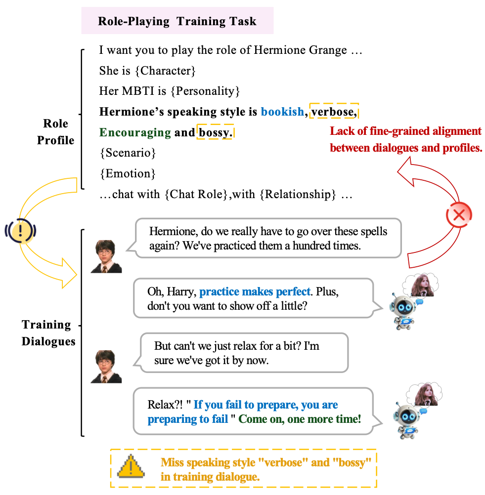
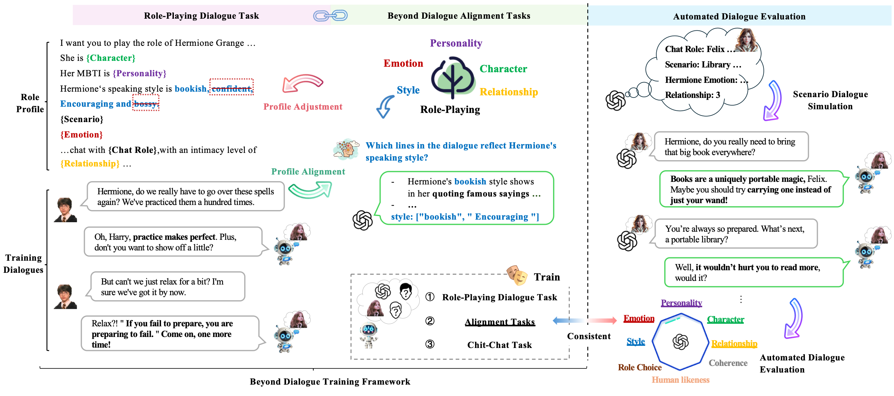
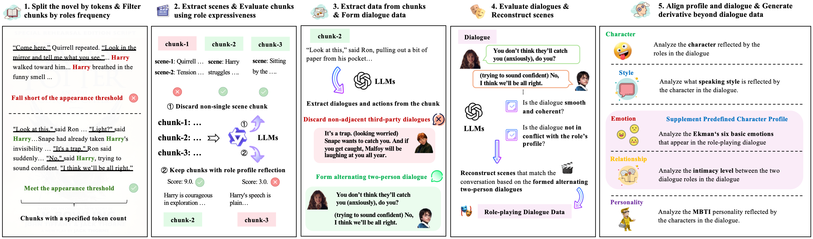
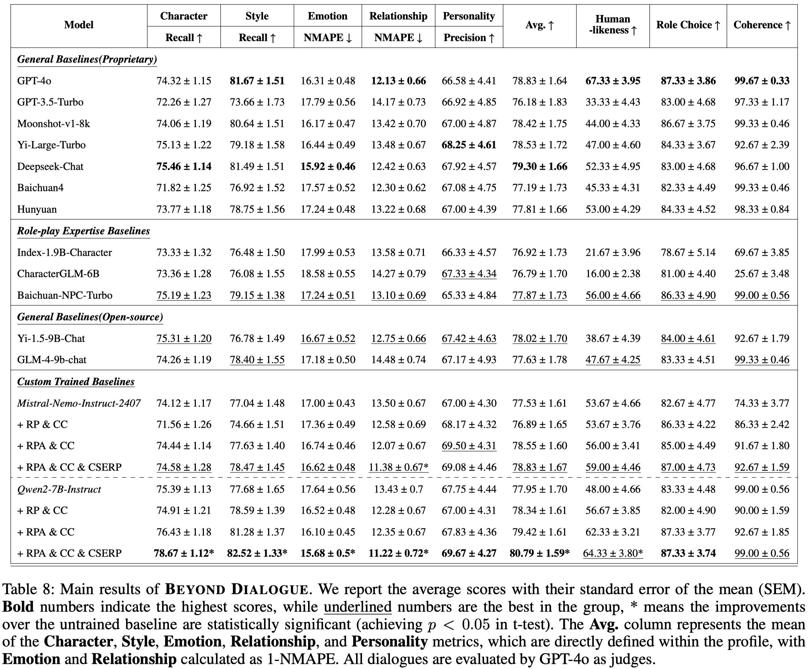
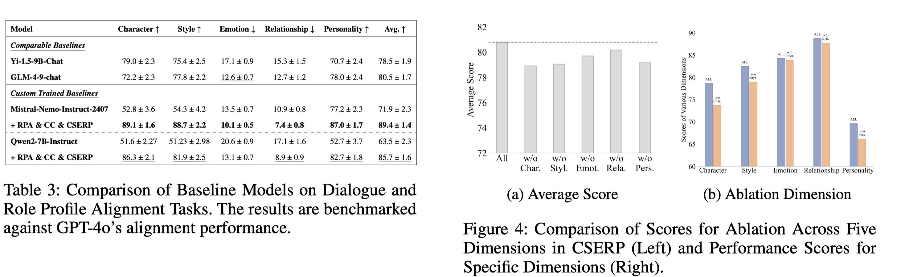
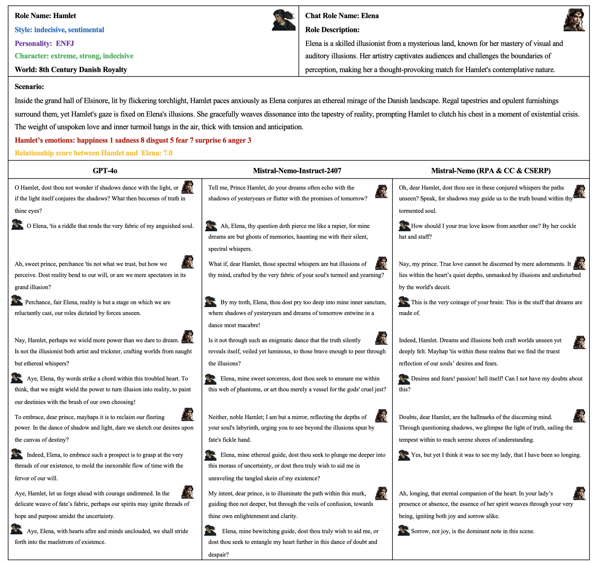

<div align= "center">
    <h1> 🎭 Beyond Dialogue 💭 </h1>
</div>
<p align="center">
<a href="https://github.com/choosewhatulike/character-llm/blob/main/LICENSE">
</a>


</p>

<p align="center">  
<strong> BEYOND DIALOGUE: A Profile-Dialogue Alignment Framework Towards General Role-Playing Language Model </strong>
</p>

<p align="center"> <strong>
📄 <a href="https://arxiv.org/abs/2408.10903">Paper</a> ·
🗂️ <a href="https://huggingface.co/datasets/yuyouyu/BeyondDialogue">Dataset</a> ·
🤗 Models (upcoming) ·
🏆 <a href="https://github.com/yuyouyu32/BeyondDialogue/tree/main/AutoRPEval">Evaluation</a>
</strong>
</p>

We introduce **BEYOND DIALOGUE**, a novel framework designed to revolutionize role-playing model training by addressing key challenges in current approaches. Traditional methods that rely on predefined role profiles, which often lead to **inconsistencies and biases between predefined profiles and scenario dialogues**, **BEYOND DIALOGUE** introduces a unique approach by **aligning dialogues with role profile traits specific to each scenario**. This approach ensures fine-grained profile-dialogue alignment at the sentence level, **fully automated and cost-effective**. Our framework outperforms existing baselines in adhering to various role profile dimensions. For more details, please refer to the [paper](https://arxiv.org/abs/2408.10903).


## What's New
- **[2024/08/29]** **Our [dataset construction](https://github.com/yuyouyu32/BeyondDialogue/tree/main/DatasetConstruct) and [evaluation](https://huggingface.co/datasets/yuyouyu/BeyondDialogue) `code` is released.**
- **[2024/08/29]** **Our [dataset](https://huggingface.co/datasets/yuyouyu/BeyondDialogue) is released.**
- **[2024/08/22]** **Our [paper](https://arxiv.org/abs/2310.00746) is released.**

## Why Profile-Dialogue Alignment? 🤔

<p align="center">
  
</p>

-  **Using a predefined role profile to prompt dialogue training for specific scenarios usually leads to inconsistencies and even conflicts between the dialogue and the profile, resulting in training biases.**
- **The model learns to imitate the role based solely on the profile, neglecting profile-dialogue alignment at the sentence level.**

## What's Beyond Dialogue? 🚀


- **We use an innovative prompting mechanism in GPT-4o to generate fine-grained CSERP alignment tasks as "beyond dialogue" training data. This approach ensures detailed alignment between profiles and dialogues, enhancing the model’s reasoning capabilities and adherence to profiles.**
- **Taking inspiration from actors learning to play different roles -- understanding the performance of various role traits in scenarios to enhance their portrayal -- we also employ fine-grained alignment tasks to train the role-playing model.**

## Framework 📚



- The left side shows the training phases, which include **role-playing dialogue, chit-chat, and profile alignment**. The profile alignment results are utilized to adjust each scenario’s dialogue profiles, eliminating training biases. 
- On the right, the **LLM generates random scenarios and roles for multi-turn dialogues with the model**, followed by an evaluation using **objective questions (such as multiple-choice questions, judgmental questions)** to obtain quantitative metrics of the model’s role-playing capabilities.

## Dataset Construction 🗂️



- **For more information about the dataset construction process and detailed statistics, please refer to our [paper](https://arxiv.org/abs/2408.10903) and [code](https://github.com/yuyouyu32/BeyondDialogue/tree/main/DatasetConstruct)**

- **The constructed dataset is available in the [Hugging Face Datasets repository](https://huggingface.co/datasets/yuyouyu/BeyondDialogue).**

## Evaluation 🏆
We use objective questions to assess eight dimensions: Character, Style, Emotion, Relationship, Personality, Human-likeness, Coherence, and Role Consistency.

1. **Automated Dialogue Generation**:
   - Generate a role and its description aligned with its worldview.
   - Create a dialogue scenario based on role profiles, design emotions, and define role relationships.
   - Engage two models in multi-turn dialogues to produce a dialogue corpus.

2. **Evaluation Approach**:
   - **CSERP**: Evaluate dialogues based on the five alignment dimensions (Character, Style, Emotion, Relationship, Personality) that are consistent with the alignment tasks used in our study.
   - **Human-likeness**: Evaluate if outputs match human expression.
   - **Coherence**: Assess dialogue continuity.
   - **Role-based Multiple-Choice**: Measure role consistency across dialogues.

**For more details, please refer to our [evaluation code](https://huggingface.co/datasets/yuyouyu/BeyondDialogue)**

## Experimental Results 📈





## Non-Cherry-Picked Cases 🍒




## Star History 🌟

[](https://star-history.com/#yuyouyu32/BeyondDialogue&Date)

## Citation 📖

**Please cite our work if you found the resources in this repository useful:**

```bibtex
@article{yu2024beyond,
  title   = {BEYOND DIALOGUE: A Profile-Dialogue Alignment Framework Towards General Role-Playing Language Model},
  author  = {Yu, Yeyong and Yu, Runsheng and Wei, Haojie and Zhang, Zhanqiu and Qian, Quan},
  year    = {2024},
  journal = {arXiv preprint arXiv:2408.10903},
}
```

## Acknowledgements 🥰

We would like to express our sincere gratitude to **Tencent LightSpeed Studios** for their invaluable support in this project. Their contributions and encouragement have been instrumental in the successful completion of our work.